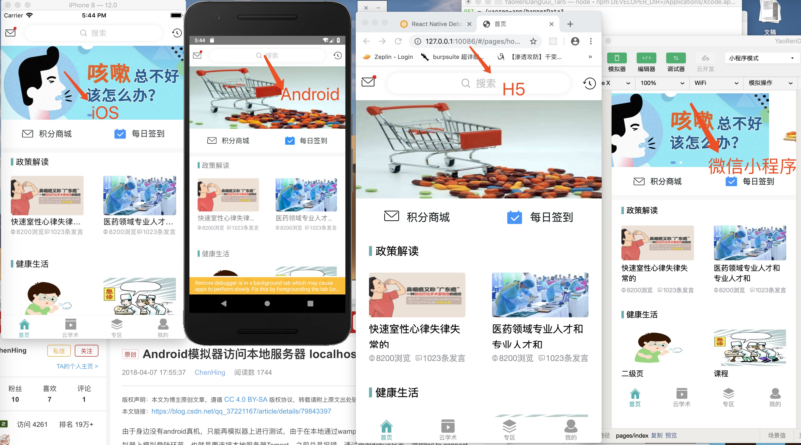
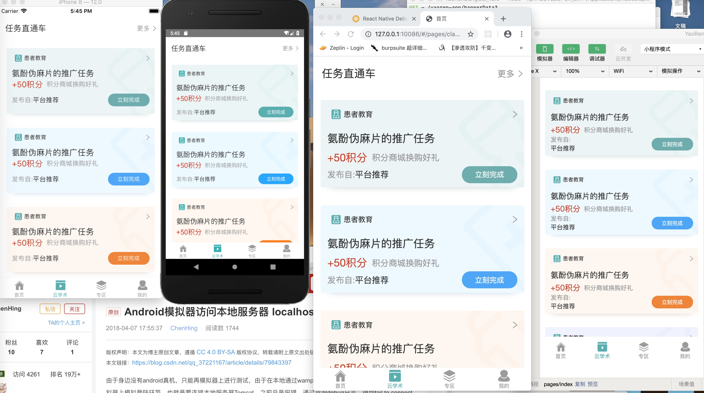
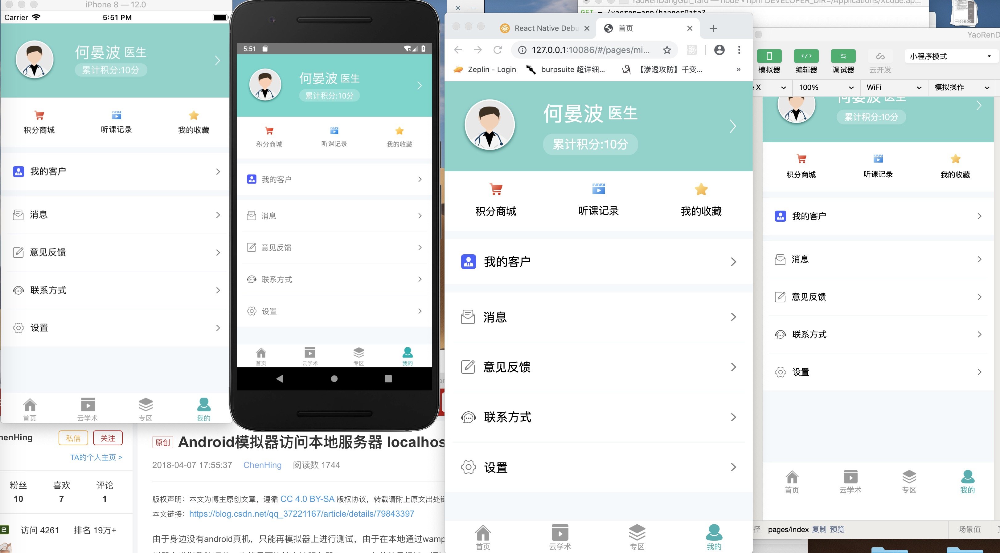

# Taro-demo
github上能找到的taro适配Android、iOS、微信小程序、H5最佳实践,主要涉及到了基础网络请求的封装、适配了多端的SafeArea安全区域、style工具样式引用替换scss的繁琐写法大幅度简化代码,同时解决了scss样式无法通过className进行属性传递的问题、自定义tabBar、全局模态对话框展示(解决了微信小程序端不能覆盖底部tabBar的问题)、展示了相同组件多端适配引用的方式、多端样式布局通过styleAssign注入flex、column、relative的方式实现统一化、演示了app的消息通信,通过mock数据在本地搭建服务进行前后端分离开发、本脚手架各端适配的比较完美适合用来进行全新项目的多端开发,后续基础组件持续完善中,目标是打造一个多端共用的基础组件库.

### 适配进度
- [x] H5 -- 完美适配
- [x] React Native -- 完美适配
- [x] 微信小程序 -- 完美适配

### 目标功能
- [ ] 打造一个多端共用的基础组件库 -- 持续开发完善中

### 样式转化
```css
 .home__search__top {
  display: flex;
  flex-direction: row;
  align-items: center;
  background: white;
  margin-left: 20px;
  margin-right: 20px;
 }
```
将上述scss写法替换为以下写法,简化布局代码,同时解决了scss样式无法通过className进行属性传递的问题
```javascript
style={styleAssign([styles.udr,styles.uac,bgColor('white'),ml(20),mr(20)]}
```

### 技术栈
typescript+eslint+redux+taro+react-native+mock


### 用法
直接clone本项目进入项目根目录执行npm install操作,然后将third_changes对应目录里面的修改项替换项目根目录node_modules里面对应的组件,react-native原生端壳子[Taro-demo-rn-shell](https://github.com/bozaigao/Taro-demo-rn-shell).
更多官方组件使用请移步[京东Taro官方文档](https://taro-docs.jd.com)、[微信小程序官方文档](https://developers.weixin.qq.com/miniprogram/dev/devtools/qywx-dev.html)
- 先打开本地mock服务命令:npm run mock
- rn端运行命令:npm run dev:rm
- h5端运行命令:npm run dev:h5
- 微信小程序端运行命令:npm run dev:weapp

### 多端适配效果图






